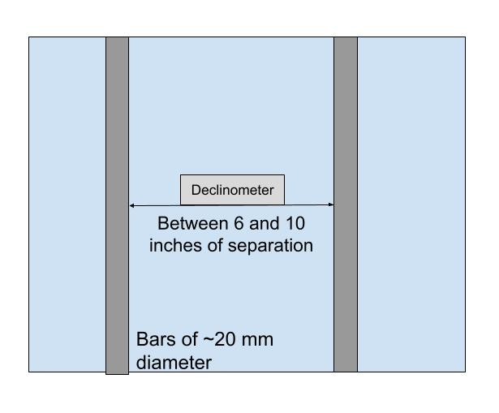

## **The Challenge:**

Build an *adjustable* mount that will rigidly hold the declinometer in place on the underside of the telescope. On the underside of the 40ft telescope there are two parallel metal bars each with diameter of ~20mm, and spaced roughly 6-10 inches apart. The declinometer needs to be oriented perpendicular to the bars, as depicted below. There is a decent amount of space above and below the bars, so you can add height as needed. The most important part of this challenge is that when the declinometer is mounted, it is rigid and not going anywhere, if the declinometer is moving in any direction (not counting the movement of the telescope . A small diagram is attached below of the underside of the scope with rough dimensions. 

 
