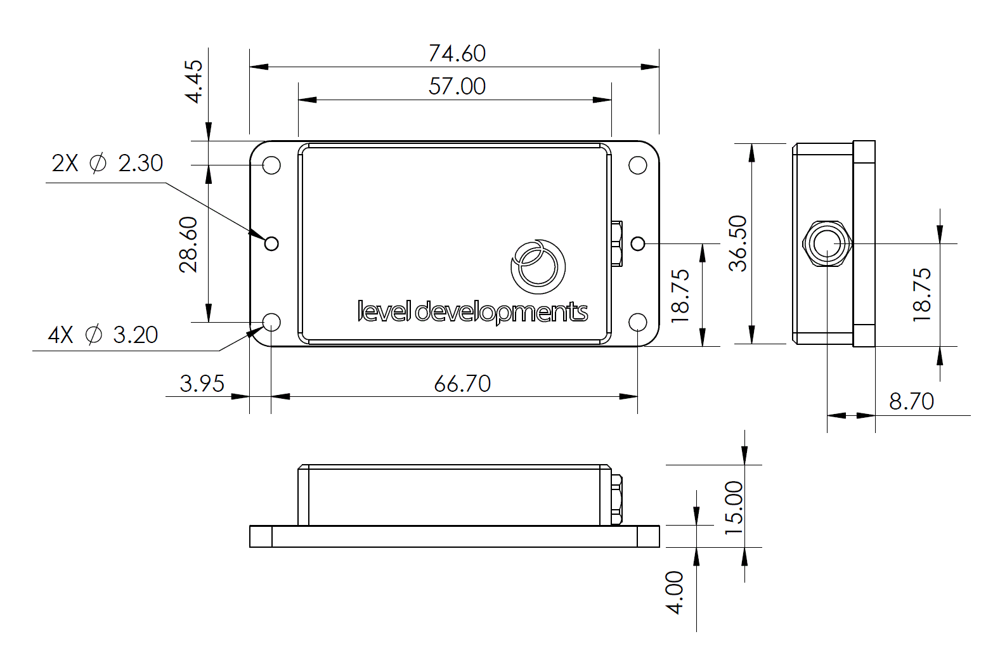

The Challenge:

Build an adjustable mount that will rigidly hold the declinometer in place on the underside of the telescope. On the underside of the 40ft telescope there are two parallel metal bars each with diameter of ~20mm, and spaced roughly 6-10 inches apart. The declinometer needs to be oriented perpendicular to the bars, but other than that, all is well that ends well. A small diagram is attached below of the underside of the scope. (More info coming soon.)

