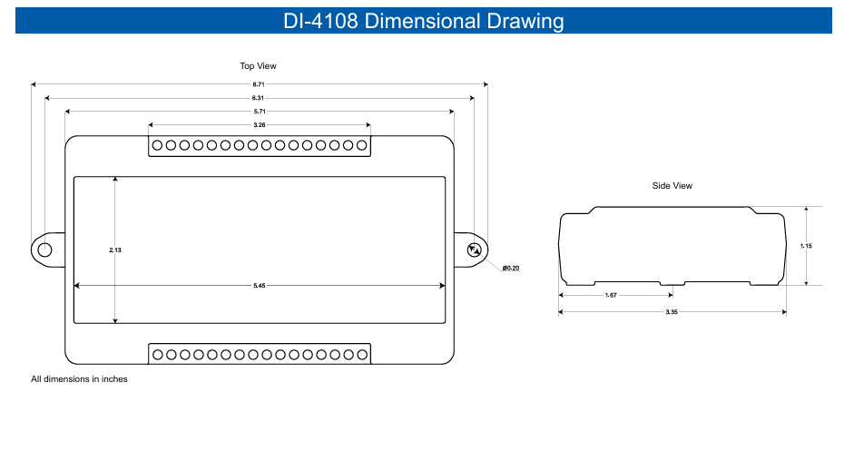
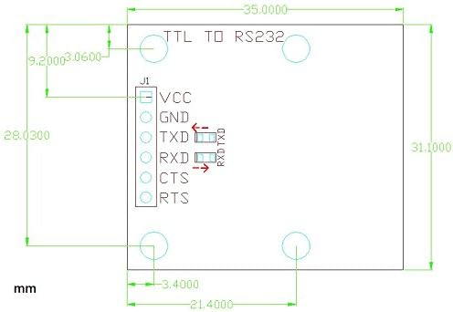
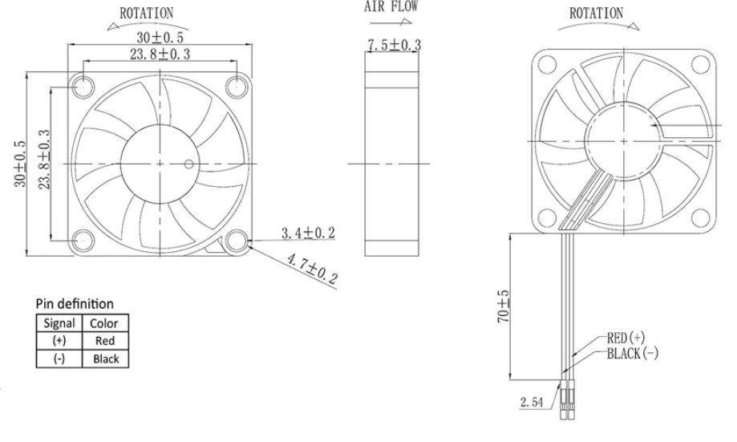

Requirements of the system:
**Let me know if there are any dimensions that are missing and I will provide them, also let me know if any of these requirments are unclear**

### Overall 
- Your design should be practical for both printing and usage. Your design should not have massive hanging components and **should not be impractical or hard to access.** Any components printed should fit within the constraints of the printer, roughly 10 inches by 8 inches. If you are unsure if a piece will fit on the print bed, export it to prusa slicer to check.
- Any ports or attached components should represent real dimensions of real products. You can use some of the wires we have in the lab here for reference, but for some ports we don't have extenders for, you should find a good product and list it in your documentation as the reason for the dimensions you chose.
- You will have to measure the dimensions of some aspects yourself.

### Exterior
- 4 exterior HDMI ports. The rpi 4b and rpi 5 natively come with 2 USB 2.0 slots and 2 USB 3.0 slots, but the DataQ requires one of the 3.0 slots to function.
- Exterior USB-C port, this should serve as the main power port for the box.
  - A secondary design challenge: If you can find a way to make this USB-C port power both the pi and the declinometer, I will be impressed.
- Exterior power port for the declinometer.
- Exterior 4-pin port for the 4-pin cable carrying signal from the declinometer.
- Exterior HDMI port to connect to monitor.
- Exterior Venting to allow for airflow and an intake for the fan.
- Exterior hole or hatch to plugging ethernet into either the Rpi or the DataQ.

### Interior
- Space to store the components each of the internal components and all the wiring associated. Keep in mind certain ports need to be welded after being set in place and the interior and exterior of the box should be designed with this in mind.
- Keep in mind the space on the additional space needed on the sides of the ports used on the raspberry pi, the male ends of the wires should be comfortably inserted and not under any stress. 
- Dimensional diagrams of the components are attached below:

[Link to a mechanical drawing of a Raspberry Pi 4b.](Photos/rpimechanical.pdf)

  
